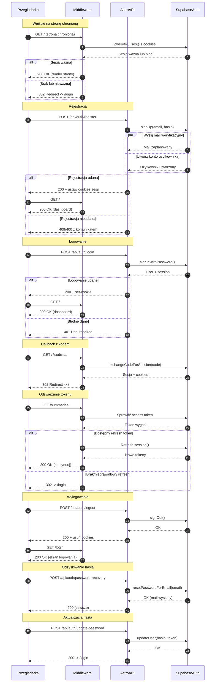

<authentication_analysis>
1) Przepływy autentykacji:
- Rejestracja użytkownika (email+hasło) i utworzenie sesji
- Logowanie użytkownika (email+hasło) i ustawienie cookies sesji
- Wejście na chronioną stronę i weryfikacja sesji w middleware
- Callback z kodem (OAuth/magic link) i wymiana kodu na sesję
- Odświeżanie tokenu po wygaśnięciu access tokenu (z refresh tokenu)
- Wylogowanie i usunięcie cookies sesji
- Odzyskiwanie hasła (wysyłka maila resetującego)
- Aktualizacja hasła z tokenu resetu

2) Główni aktorzy i interakcje:
- Przegladarka: inicjuje nawigacje i żądania do API, trzyma cookies
- Middleware: na każdą prośbę o stronę sprawdza sesję i przekierowuje
- AstroAPI: obsługuje POST-y auth (register/login/logout/reset/update)
- SupabaseAuth: usługa uwierzytelniania (signUp/signIn/refresh/signOut)

3) Weryfikacja i odświeżanie tokenów:
- Middleware czyta cookies i weryfikuje sesję przez Supabase
- Gdy access token wygasł, próbuje odświeżyć z refresh tokenu
- Po sukcesie odświeżenia ustawia nowe cookies i kontynuuje
- Po porażce czyści cookies i przekierowuje na /login

4) Krótkie opisy kroków:
- Rejestracja: przeglądarka -> API register -> Supabase signUp -> cookies -> /
- Logowanie: przeglądarka -> API login -> Supabase signIn -> cookies -> /
- Ochrona stron: middleware weryfikuje sesję; brak -> /login
- Callback: middleware wymienia code na sesję, zapisuje cookies, -> /
- Odświeżanie: middleware widzi expired, odświeża, zapisuje cookies lub logout
- Wylogowanie: przeglądarka -> API logout -> Supabase signOut -> czyści cookies
- Reset hasła: przeglądarka -> API password-recovery -> mail wysłany
- Aktualizacja hasła: przeglądarka -> API update-password (z tokenem) -> OK
</authentication_analysis>

<mermaid_diagram>

</mermaid_diagram>
