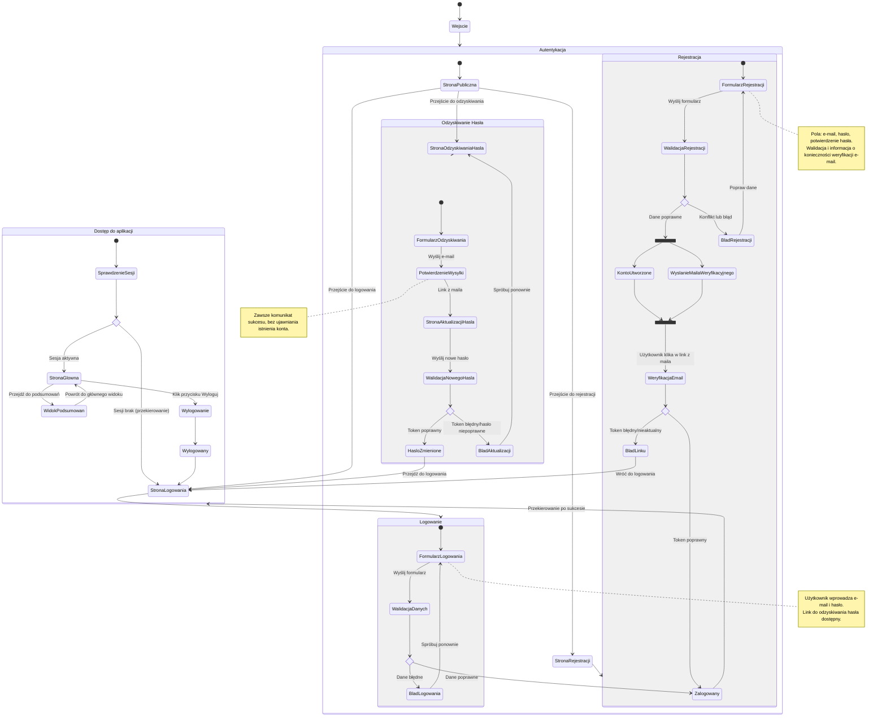

<user_journey_analysis>
1) Ścieżki użytkownika (na podstawie PRD i specyfikacji autentykacji):
- Wejście do aplikacji jako niezalogowany.
- Próba wejścia na obszary chronione (strona główna, podsumowania) → przekierowanie do logowania.
- Logowanie (formularz logowania → walidacja → powodzenie/błąd → przekierowanie na stronę główną).
- Rejestracja (formularz rejestracji → walidacja → utworzenie konta → wysłanie maila weryfikacyjnego → przekierowanie na stronę główną).
- Odzyskiwanie hasła (formularz odzyskiwania → potwierdzenie wysyłki maila → link w wiadomości → strona aktualizacji hasła → zmiana hasła → powrót do logowania).
- Wylogowanie (przycisk wylogowania → powrót do logowania lub strony publicznej).

2) Główne podróże i odpowiadające stany:
- Podróż niezalogowanego użytkownika: StronaLogowania, StronaRejestracji, StronaOdzyskiwaniaHasla.
- Podróż logowania: FormularzLogowania → WalidacjaDanych → PróbaUwierzytelnienia → Zalogowany → StronaGlowna.
- Podróż rejestracji: FormularzRejestracji → WalidacjaDanych → UtworzenieKonta + WyslanieMaila (równolegle) → (opcjonalnie) WeryfikacjaEmail → Zalogowany → StronaGlowna.
- Podróż odzyskiwania: FormularzOdzyskiwania → PotwierdzenieWysylki → LinkEmail → StronaAktualizacjiHasla → WalidacjaNowegoHasla → HasloZmienione → StronaLogowania.
- Dostęp do funkcji po zalogowaniu: StronaGlowna, WidokPodsumowan, Nawigacja, Wylogowanie.

3) Punkty decyzyjne i alternatywne ścieżki:
- if_sesja: czy użytkownik ma ważną sesję (middleware, cookies) → tak: dostęp do obszarów chronionych, nie: przekierowanie do logowania.
- if_dane_logowania: poprawność danych logowania → tak: zalogowany, nie: błąd logowania i pozostanie na formularzu.
- if_rejestracja_poprawna: czy dane i konto są poprawne/unikalne → tak: konto utworzone, nie: komunikat o konflikcie (np. email istnieje).
- if_token_email: weryfikacja tokenu w linku mailowym (rejestracja/OAuth) → poprawny: sesja aktywna i powrót do aplikacji, błędny: komunikat o błędnym/nieaktualnym linku.
- if_token_reset: weryfikacja tokenu resetu hasła → poprawny: można ustawić nowe hasło, błędny: komunikat o błędzie i powrót do odzyskiwania.

4) Krótkie opisy stanów:
- StronaLogowania: dostępny formularz logowania oraz linki do rejestracji/odzyskiwania.
- FormularzLogowania: wprowadzenie e-mail/hasła, walidacja, wysłanie.
- BladLogowania: prezentacja błędu (np. nieprawidłowe dane) i możliwość ponownej próby.
- StronaRejestracji: dostępny formularz rejestracji.
- FormularzRejestracji: e-mail, hasło, potwierdzenie; walidacja, wysłanie.
- KontoUtworzone: konto poprawnie utworzone, mail weryfikacyjny wysłany.
- WeryfikacjaEmail: użytkownik otwiera link weryfikacyjny z maila.
- StronaOdzyskiwaniaHasla: formularz wprowadzenia e-maila do resetu.
- PotwierdzenieWysylki: informacja o wysłaniu maila z instrukcjami.
- StronaAktualizacjiHasla: formularz ustawienia nowego hasła.
- HasloZmienione: sukces zmiany hasła; przejście do logowania.
- StronaGlowna: główny widok (dashboard), dostępny po zalogowaniu.
- WidokPodsumowan: widok dziennych podsumowań; wymaga zalogowania.
- Wylogowany: brak sesji, powrót do logowania/stron publicznych.
</user_journey_analysis>

<mermaid_diagram>

</mermaid_diagram>
