<architecture_analysis>
1) Komponenty i elementy związane z autentykacją (stan obecny i planowane):
- Astro Layouty/Strony:
  - src/layouts/Layout.astro (do aktualizacji pod widok zal/niezal)
  - src/pages/index.astro (do ochrony – przekierowanie niezalogowanych)
  - src/pages/summaries.astro (używa Astro.locals.supabase; do ochrony – przekierowanie niezalogowanych)
  - NOWE: src/pages/login.astro, src/pages/register.astro, src/pages/password-recovery.astro, src/pages/update-password.astro
- React (komponenty klienckie):
  - src/components/layout/TopNavigationBar.tsx (do aktualizacji – render zależny od sesji)
  - NOWE: src/components/auth/LoginForm.tsx, RegisterForm.tsx, PasswordRecoveryForm.tsx, UpdatePasswordForm.tsx, LogoutButton.tsx
- Middleware:
  - src/middleware/index.ts (obecnie wstrzykuje locals.supabase; do rozbudowy: weryfikacja sesji, przekierowania, obsługa callbacków)
- API (Astro API Routes):
  - Istniejące zabezpieczone endpointy domenowe (tasks, time-entries, summary) weryfikują usera przez locals.supabase.auth.getUser()
  - NOWE: operacje autentykacji (rejestracja, logowanie, wylogowanie, odzyskiwanie hasła, aktualizacja hasła)
- Supabase:
  - src/db/supabase.client.ts (klient), Database typy, RLS i user_id w danych (zgodnie ze spec.)
- Typy (DTO):
  - src/types.ts: RegisterRequestDto, LoginRequestDto, AuthUserDto, AuthSessionDto, AuthResponseDto

2) Główne strony i przypisane komponenty:
- Publiczne: /login (LoginForm), /register (RegisterForm), /password-recovery (PasswordRecoveryForm), /update-password (UpdatePasswordForm)
- Chronione: / (dashboard) oraz /summaries (widok podsumowań) – renderowane w Layout.astro; TopNavigationBar zależny od stanu auth; LogoutButton widoczny dla zalogowanych

3) Przepływ danych:
- Formularze React → wywołania do operacji Auth (zod walidacja po stronie klienta i serwera)
- API Auth → Supabase Auth (signUp/signInWithPassword/signOut/resetPasswordForEmail/updateUser) → ustawienie/wyczyszczenie cookies (Astro.cookies)
- Middleware → weryfikacja sesji (z cookies) → zapis do Astro.locals (session, user, supabase) → kontrola dostępu (redirecty)
- Layout.astro/TopNavigationBar.tsx → odczyt Astro.locals → warunkowe UI
- Chronione API domenowe → locals.supabase.auth.getUser() → autoryzacja przez user_id i RLS

4) Krótkie opisy funkcjonalności:
- LoginForm/RegisterForm/PasswordRecoveryForm/UpdatePasswordForm: walidacja (react-hook-form + zod), wysyłka do operacji Auth, obsługa błędów, nawigacja po sukcesie
- LogoutButton: wywołanie operacji wylogowania, odświeżenie/przekierowanie
- Layout.astro: wspólny layout; różnicuje nawigację wg sesji
- TopNavigationBar.tsx: prezentuje linki logowania/rejestracji vs. profil/wylogowanie
- Middleware: centralna weryfikacja sesji, redirecty, obsługa OAuth callbacków (wg spec.)
- API Auth: rejestracja/logowanie/wylogowanie/odzyskiwanie/aktualizacja hasła; walidacja zod; operacje Supabase; zarządzanie cookies
- Supabase: dostawca auth, RLS; powiązanie danych przez user_id

```mermaid
flowchart TD

%% Klasy stylów
classDef updated fill:#FFF3BF,stroke:#B58900,stroke-width:2px,color:#513C06;
classDef new fill:#E6FFFA,stroke:#2C7A7B,stroke-width:2px,color:#234E52;
classDef service fill:#EDF2F7,stroke:#4A5568,stroke-width:1.5px,color:#1A202C;
classDef api fill:#EBF8FF,stroke:#3182CE,stroke-width:1.5px,color:#2A4365;
classDef store fill:#F0FFF4,stroke:#2F855A,stroke-width:1.5px,color:#22543D;

%% Wejście użytkownika
U["Użytkownik"]

%% Warstwa Layoutu i Nawigacji
subgraph LYT["Nawigacja i Layout"]
  L1["Layout.astro"]:::updated
  L2["TopNavigationBar.tsx"]:::updated
  L3["LogoutButton.tsx"]:::new
end

%% Strony Publiczne
subgraph PUB["Strony Publiczne (Astro)"]
  P1["/login (login.astro)"]:::new
  P2["/register (register.astro)"]:::new
  P3["/password-recovery (password-recovery.astro)"]:::new
  P4["/update-password (update-password.astro)"]:::new
end

%% Strony Chronione
subgraph PROT["Strony Chronione (Astro)"]
  C1["/ (index.astro)"]:::updated
  C2["/summaries (summaries.astro)"]:::updated
end

%% Formularze (React)
subgraph FRM["Formularze Autentykacji (React)"]
  F1["LoginForm.tsx"]:::new
  F2["RegisterForm.tsx"]:::new
  F3["PasswordRecoveryForm.tsx"]:::new
  F4["UpdatePasswordForm.tsx"]:::new
end

%% Walidacja i stan UI (kliencki)
subgraph STC["Walidacja i Stan (klient)"]
  V1[["react-hook-form"]]:::store
  V2[["zod (schematy)"]]:::store
end

%% Middleware i kontekst serwera
subgraph MID["Middleware i Kontekst (SSR)"]
  M1["middleware/index.ts"]:::updated
  M2["Astro.locals: session,user,supabase"]:::service
  M3["Astro.cookies (sesja)"]:::service
end

%% API Auth (abstrakcja operacji, bez URL)
subgraph APIA["API Autentykacji (Astro API)"]
  A1["Rejestracja (API)"]:::api
  A2["Logowanie (API)"]:::api
  A3["Wylogowanie (API)"]:::api
  A4["Odzyskiwanie hasła (API)"]:::api
  A5["Aktualizacja hasła (API)"]:::api
end

%% API Danych Domenowych (chronione)
subgraph APID["API Danych (chronione)"]
  D1["Zadania (Tasks API)"]:::api
  D2["Podsumowanie dzienne (Summary API)"]:::api
  D3["Sesje czasu (Time Entries API)"]:::api
end

%% Supabase i Baza
subgraph SUPA["Supabase Auth + DB"]
  S1[("Supabase Auth")]:::service
  S2[("Baza danych + RLS")]:::service
end

%% Klient Supabase
SCL["supabase.client.ts"]:::service

%% Połączenia użytkownika z UI
U --> L1
U --> P1
U --> P2
U --> P3
U --> P4
U --> C1
U --> C2

%% Renderowanie formularzy na stronach
P1 --> F1
P2 --> F2
P3 --> F3
P4 --> F4

%% Walidacja na kliencie
F1 -. używa .-> V1
F1 -. używa .-> V2
F2 -. używa .-> V1
F2 -. używa .-> V2
F3 -. używa .-> V1
F3 -. używa .-> V2
F4 -. używa .-> V1
F4 -. używa .-> V2

%% Wywołania API z formularzy
F1 -- "submit" --> A2
F2 -- "submit" --> A1
F3 -- "submit" --> A4
F4 -- "submit" --> A5

%% Logout
L3 -- "klik" --> A3

%% API Auth -> Supabase Auth i Cookies
A1 ==> S1
A2 ==> S1
A3 ==> S1
A4 ==> S1
A5 ==> S1
A1 -. zarządza .-> M3
A2 -. zarządza .-> M3
A3 -. czyści .-> M3
A5 -. aktualizuje .-> M3

%% Middleware: weryfikacja i kontekst
M1 -- "czyta" --> M3
M1 -- "tworzy" --> M2
M1 -- "redirecty" --> P1

%% Layout/Nawigacja: zależne od kontekstu
M2 -. dostarcza .-> L1
M2 -. dostarcza .-> L2

%% Strony chronione: zależne od kontekstu
M2 -. dostarcza .-> C1
M2 -. dostarcza .-> C2

%% Strony i API domenowe: wymagają sesji
C1 -. używa .-> SCL
C2 -. używa .-> SCL
D1 -- "getUser()" --> M2
D2 -- "getUser()" --> M2
D3 -- "getUser()" --> M2

%% Supabase klient i serwis
SCL --- S1
S1 --- S2

%% Przepływy dodatkowe
L2 -- "Wyloguj" --> L3
P1 -. po sukcesie .-> C1
P2 -. po sukcesie .-> C1
P4 -. po sukcesie .-> P1
```

</architecture_analysis>

<mermaid_diagram>

</mermaid_diagram>
